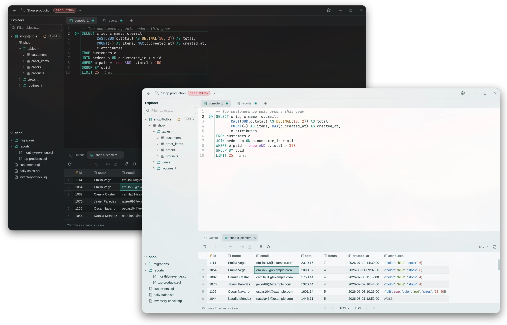
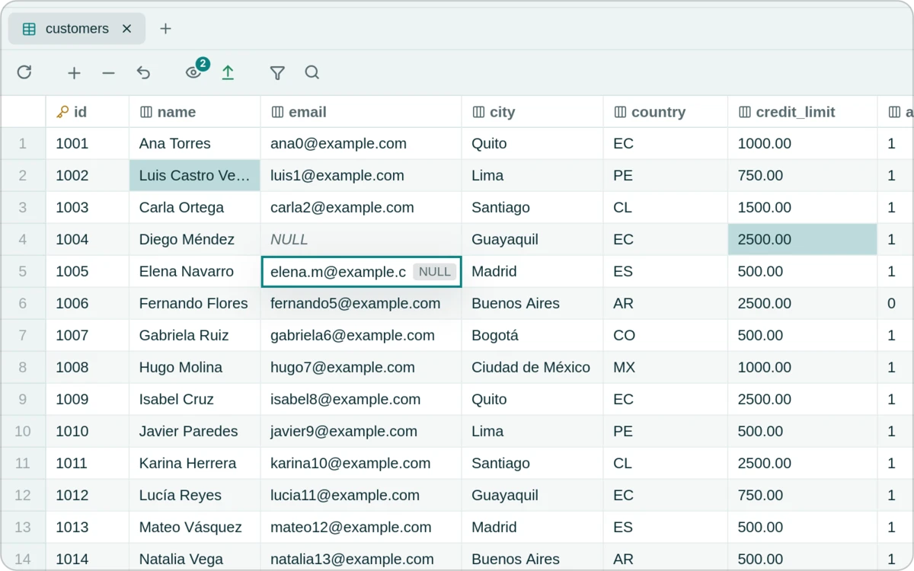
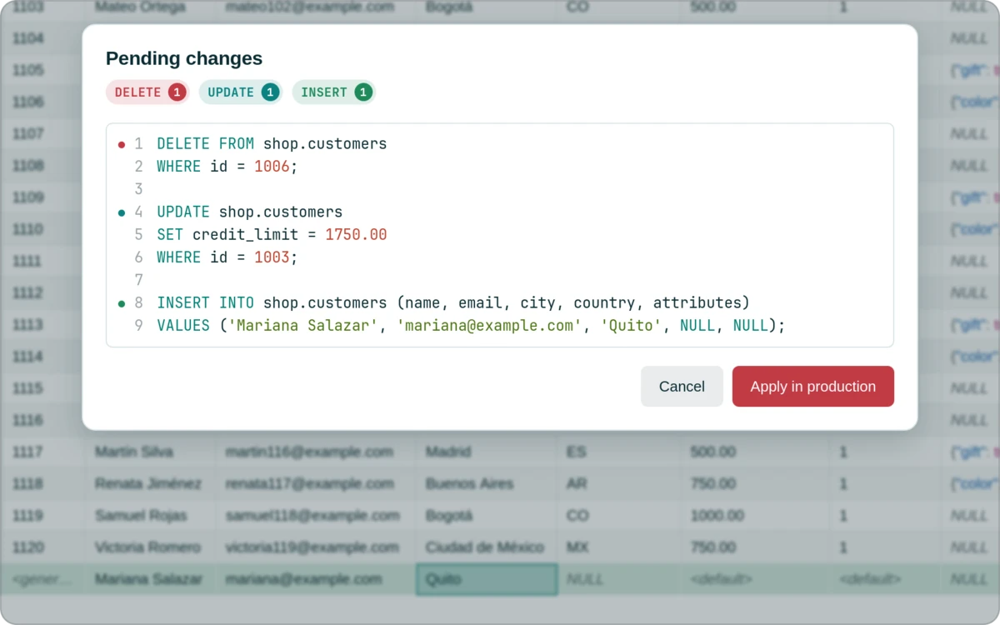
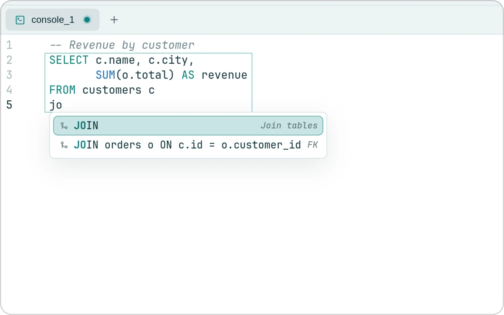
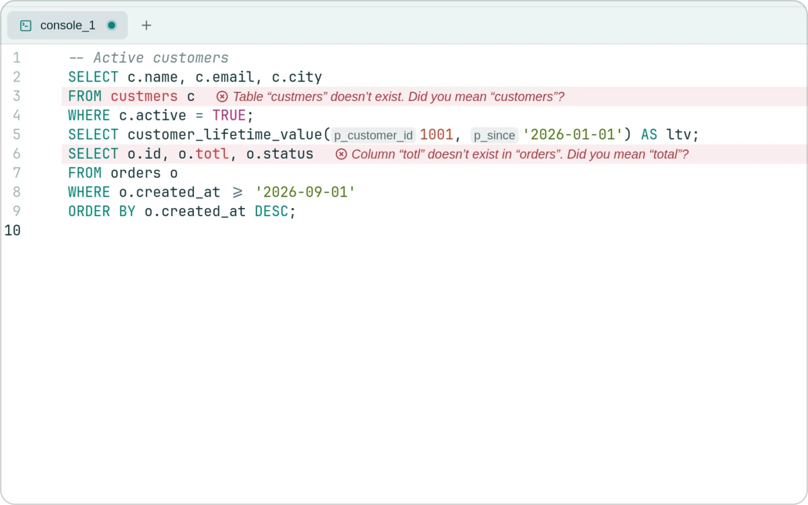
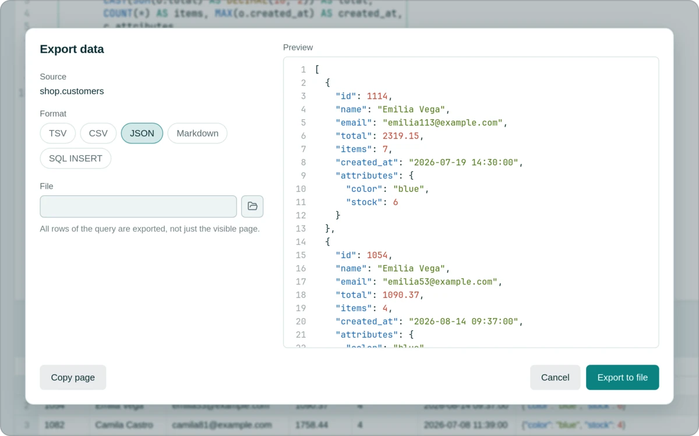
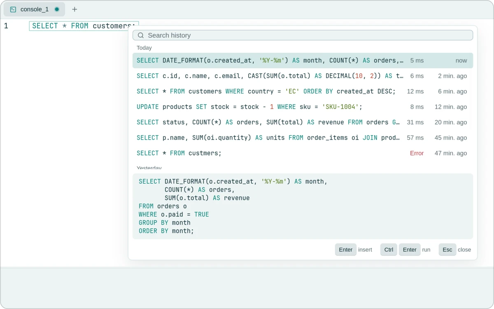
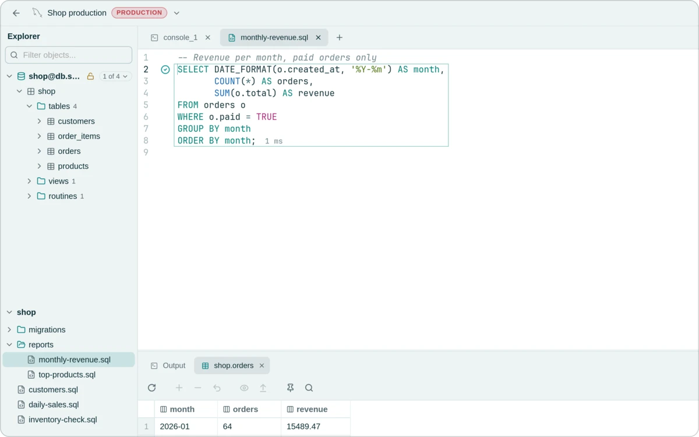
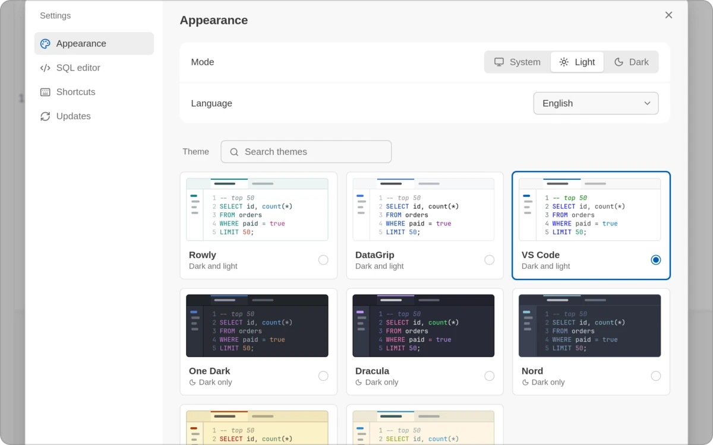

<div align="center">

<picture>
  <source media="(prefers-color-scheme: dark)" srcset="docs/assets/brand/rowly-logo-dark.svg">
  
</picture>

<h3>Cliente SQL libre y de código abierto</h3>

<p>
  <a href="https://github.com/anderson-andres-dev/rowly-db/releases/latest"><strong>Descargar</strong></a>
  &nbsp;·&nbsp;
  <a href="#instalación">Instalación</a>
  &nbsp;·&nbsp;
  <a href="README.md">English</a>
</p>

<p>
  <a href="https://github.com/anderson-andres-dev/rowly-db/releases/latest"></a>
  
</p>

</div>

<br>

<p align="center">
  <picture>
    <source media="(prefers-color-scheme: dark)" srcset="docs/assets/rowly-db-dark.webp">
    
  </picture>
</p>

<br>

<table>
  <tr>
    <td width="50%" valign="top">
      <picture>
        <source media="(prefers-color-scheme: dark)" srcset="docs/assets/features/inline-edit-dark.webp">
        
      </picture>
      <p><strong>Edición en la celda</strong><br>Cambia cualquier valor. Nada se escribe hasta que aplicas.</p>
    </td>
    <td width="50%" valign="top">
      <picture>
        <source media="(prefers-color-scheme: dark)" srcset="docs/assets/features/add-rows-dark.webp">
        
      </picture>
      <p><strong>Revisa antes de ejecutar</strong><br>Las filas que agregas, editas o borras se vuelven el SQL exacto que apruebas.</p>
    </td>
  </tr>
  <tr>
    <td width="50%" valign="top">
      <picture>
        <source media="(prefers-color-scheme: dark)" srcset="docs/assets/features/autocomplete-dark.webp">
        
      </picture>
      <p><strong>Autocompletado que conoce tu esquema</strong><br>Tablas, columnas y JOIN completos a partir de las claves foráneas.</p>
    </td>
    <td width="50%" valign="top">
      <picture>
        <source media="(prefers-color-scheme: dark)" srcset="docs/assets/features/diagnostics-dark.webp">
        
      </picture>
      <p><strong>Errores a la vista mientras escribes</strong><br>Tablas y columnas que no existen, con el nombre que querías.</p>
    </td>
  </tr>
  <tr>
    <td width="50%" valign="top">
      <picture>
        <source media="(prefers-color-scheme: dark)" srcset="docs/assets/features/export-dark.webp">
        
      </picture>
      <p><strong>Exportar</strong><br>TSV, CSV, JSON, Markdown o SQL INSERT.</p>
    </td>
    <td width="50%" valign="top">
      <picture>
        <source media="(prefers-color-scheme: dark)" srcset="docs/assets/features/history-dark.webp">
        
      </picture>
      <p><strong>Historial</strong><br>Cada consulta que ejecutaste, a un <kbd>Ctrl</kbd>+<kbd>E</kbd>.</p>
    </td>
  </tr>
  <tr>
    <td width="50%" valign="top">
      <picture>
        <source media="(prefers-color-scheme: dark)" srcset="docs/assets/features/files-dark.webp">
        
      </picture>
      <p><strong>Tus archivos SQL</strong><br>Abre una carpeta y ten tus scripts junto a la conexión.</p>
    </td>
    <td width="50%" valign="top">
      <picture>
        <source media="(prefers-color-scheme: dark)" srcset="docs/assets/features/themes-dark.webp">
        
      </picture>
      <p><strong>Temas</strong><br>Ocho temas, claros y oscuros.</p>
    </td>
  </tr>
</table>

<p align="center">
  <sub>Pensado para el teclado &nbsp;·&nbsp; En producción cada escritura pide confirmación &nbsp;·&nbsp; Las contraseñas quedan en el almacén seguro del sistema &nbsp;·&nbsp; Las actualizaciones se instalan cuando tú decides</sub>
</p>

## Instalación

Descarga el paquete para tu sistema desde la [última versión](https://github.com/anderson-andres-dev/rowly-db/releases/latest).

| Sistema | Paquete | Instalar |
| :--- | :--- | :--- |
| Windows | `.msi` o `.exe` | Ejecuta el instalador |
| macOS | `.dmg` | Ábrelo y arrastra Rowly DB a Aplicaciones |
| Debian, Ubuntu | `.deb` | `sudo apt install ./Rowly*.deb` |
| Fedora | `.rpm` | `sudo dnf install ./Rowly*.rpm` |
| Arch | `.pkg.tar.zst` | `sudo pacman -U ./rowly-db_*.pkg.tar.zst` |
| Cualquier Linux | `.AppImage` | `chmod +x Rowly*.AppImage && ./Rowly*.AppImage` |

Los paquetes Linux son para x86_64. Las nuevas versiones aparecen en **Ajustes → Actualizaciones**.

<details>
<summary><strong>Compilar desde el código</strong></summary>
<br>

Necesitas Rust 1.85+, Node.js 20.19+ y las [dependencias de Tauri](https://tauri.app/start/prerequisites/).

```bash
git clone https://github.com/anderson-andres-dev/rowly-db.git
cd rowly-db/app
npm ci
npm run tauri build
```

Los paquetes quedan en `target/release/bundle/`.

</details>

## Contribuir

Los reportes de errores y los pull requests son bienvenidos. Empieza por la [guía de desarrollo](CONTRIBUTING.es.md) o [abre un issue](https://github.com/anderson-andres-dev/rowly-db/issues).

## Licencia

Rowly DB tiene licencia dual: [MIT](LICENSE-MIT) o [Apache 2.0](LICENSE-APACHE), a tu elección.
