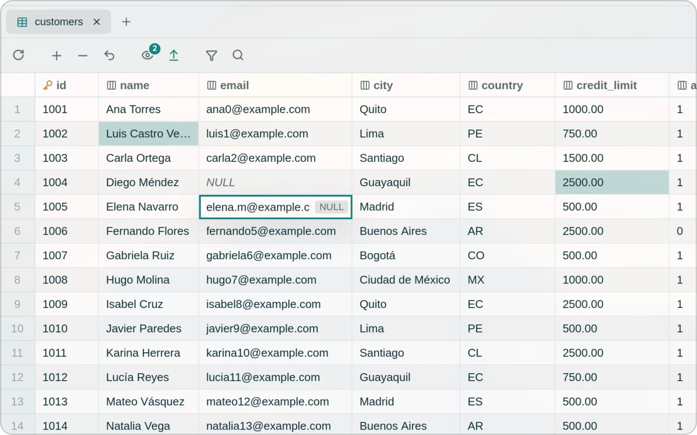
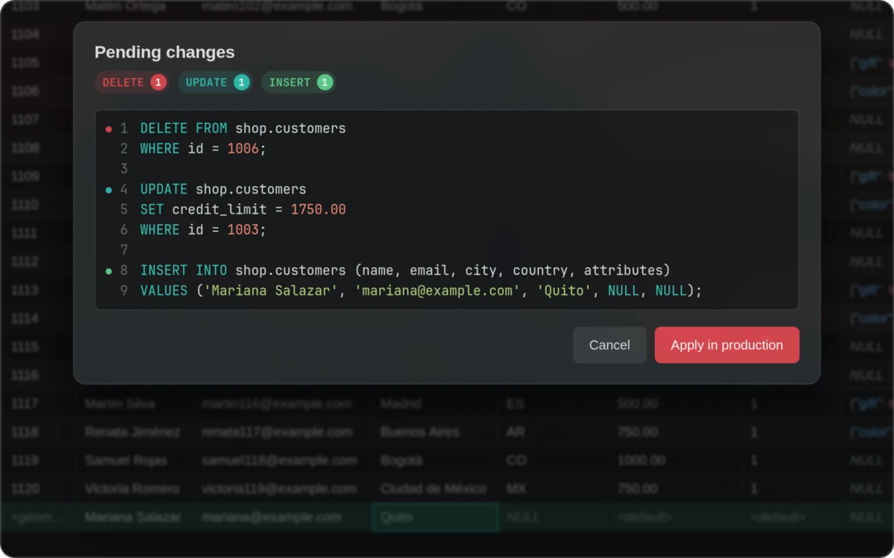
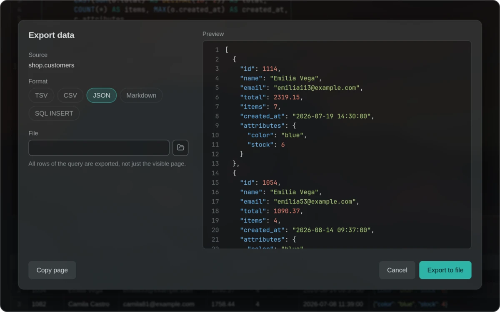
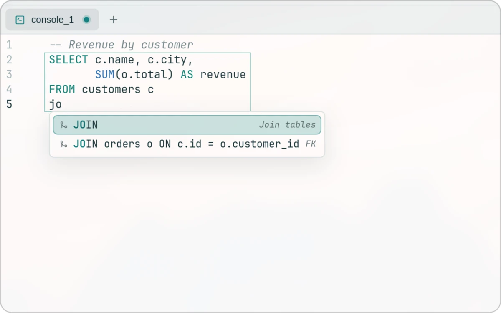
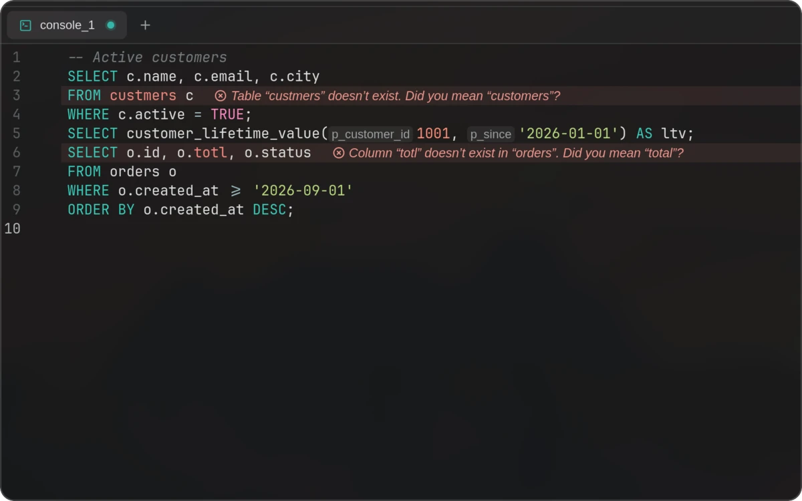
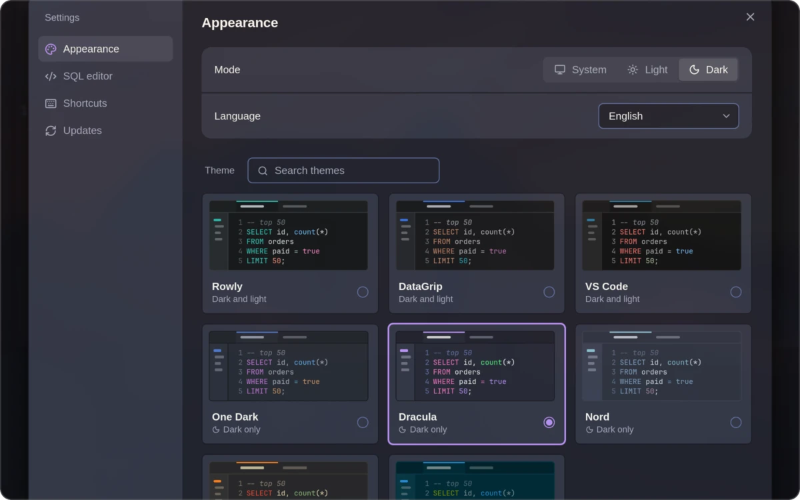
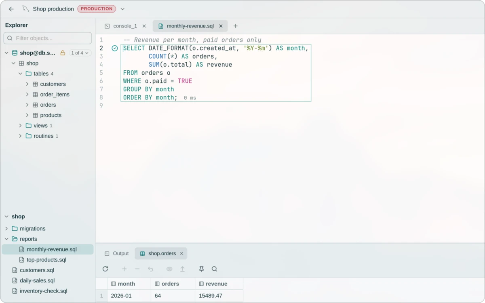
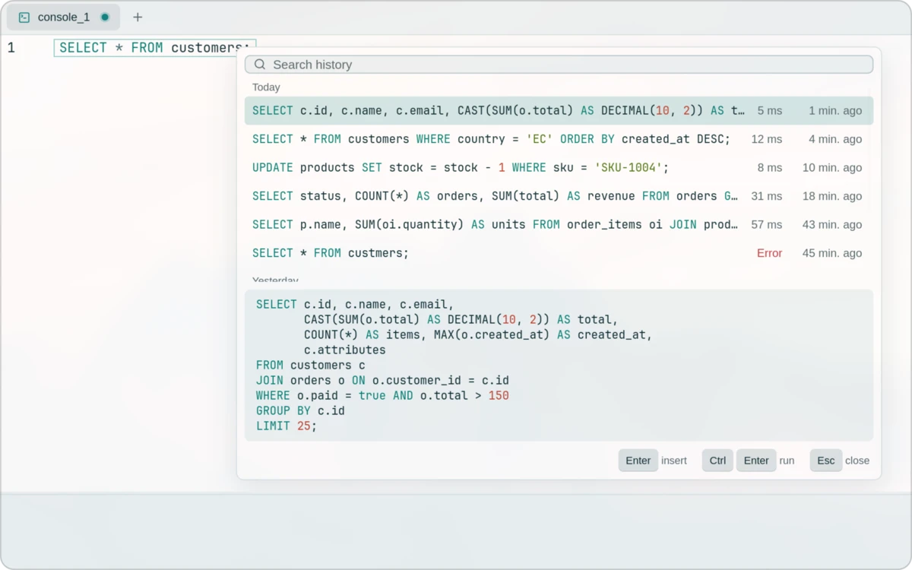

<div align="center">

<picture>
  <source media="(prefers-color-scheme: dark)" srcset="docs/assets/brand/rowly-logo-dark.svg">
  
</picture>

<br>

<p>
  <a href="https://github.com/anderson-andres-dev/rowly-db/releases"><strong>Download Rowly DB</strong></a>
  &nbsp;·&nbsp;
  <a href="#installation">Installation</a>
  &nbsp;·&nbsp;
  <a href="README.es.md">Español</a>
</p>

<p>
  <a href="https://github.com/anderson-andres-dev/rowly-db/stargazers"></a>
  <a href="https://github.com/anderson-andres-dev/rowly-db/issues"></a>
  <a href="https://github.com/anderson-andres-dev/rowly-db/pulls"></a>
  <a href="docs/assets/rowly-db.webp"></a>
</p>

</div>

<br>

<p align="center">
  
</p>

## Features

<table>
  <tr>
    <td width="50%" valign="top">
      
      <br><strong>Inline editing</strong>
      <br><sub>Double-click a cell to edit it. Changes stay highlighted until you apply them.</sub>
    </td>
    <td width="50%" valign="top">
      
      <br><strong>Add and delete rows</strong>
      <br><sub>Review the exact SQL before it runs. Production connections always ask first.</sub>
    </td>
  </tr>
  <tr>
    <td width="50%" valign="top">
      
      <br><strong>Export data</strong>
      <br><sub>TSV, CSV, JSON, Markdown or SQL INSERT, with a live preview.</sub>
    </td>
    <td width="50%" valign="top">
      
      <br><strong>Smart autocomplete</strong>
      <br><sub>Suggests tables, columns and full JOINs built from foreign keys.</sub>
    </td>
  </tr>
  <tr>
    <td width="50%" valign="top">
      
      <br><strong>Inline diagnostics</strong>
      <br><sub>Unknown tables and columns are flagged as you type, with a suggested fix.</sub>
    </td>
    <td width="50%" valign="top">
      
      <br><strong>Themes</strong>
      <br><sub>Rowly, DataGrip, VS Code, Gruvbox, Solarized, One Dark, Dracula and Nord.</sub>
    </td>
  </tr>
  <tr>
    <td width="50%" valign="top">
      
      <br><strong>SQL file explorer</strong>
      <br><sub>Open a folder of .sql files and edit them next to your connection.</sub>
    </td>
    <td width="50%" valign="top">
      
      <br><strong>Query history</strong>
      <br><sub>Ctrl+E finds and reruns any query you ran on this connection.</sub>
    </td>
  </tr>
</table>

Also: MySQL, MariaDB and PostgreSQL · Passwords in the system keyring · Signed updates you confirm

## Installation

Download your package from [Releases](https://github.com/anderson-andres-dev/rowly-db/releases).
Run the command in the download folder. Linux packages target **x86_64**.

| Linux | Install |
| :--- | :--- |
| Debian based `.deb` | `sudo apt install ./Rowly*.deb` |
| Fedora based `.rpm` | `sudo dnf install ./Rowly*.rpm` |
| Arch based `.pkg.tar.zst` | `sudo pacman -U ./rowly-db_*.pkg.tar.zst` |
| AppImage | `chmod +x ./Rowly*.AppImage`<br>`./Rowly*.AppImage` |

For **Windows**, run the `.msi` or `.exe`. For **macOS**, open the `.dmg` for
your processor and drag Rowly DB to Applications.

Updates are available in **Settings → Updates**.

## Build from source

Requires Rust 1.85+, Node.js 20.19+, and the [Tauri dependencies](https://tauri.app/start/prerequisites/).

```bash
git clone https://github.com/anderson-andres-dev/rowly-db.git
cd rowly-db/app
npm ci
npm run tauri build
```

Packages are written to `target/release/bundle/`.

## Contributing

[Development guide](CONTRIBUTING.md) · [Report an issue](https://github.com/anderson-andres-dev/rowly-db/issues)

## License

Dual licensed. Choose [MIT](LICENSE-MIT) or [Apache 2.0](LICENSE-APACHE).
