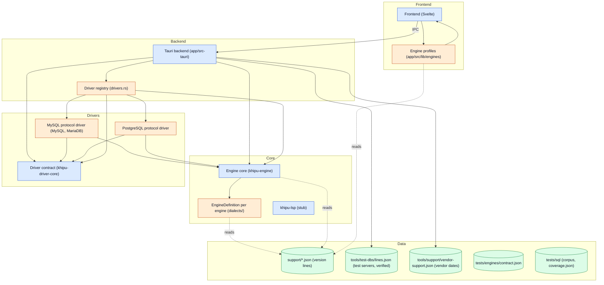
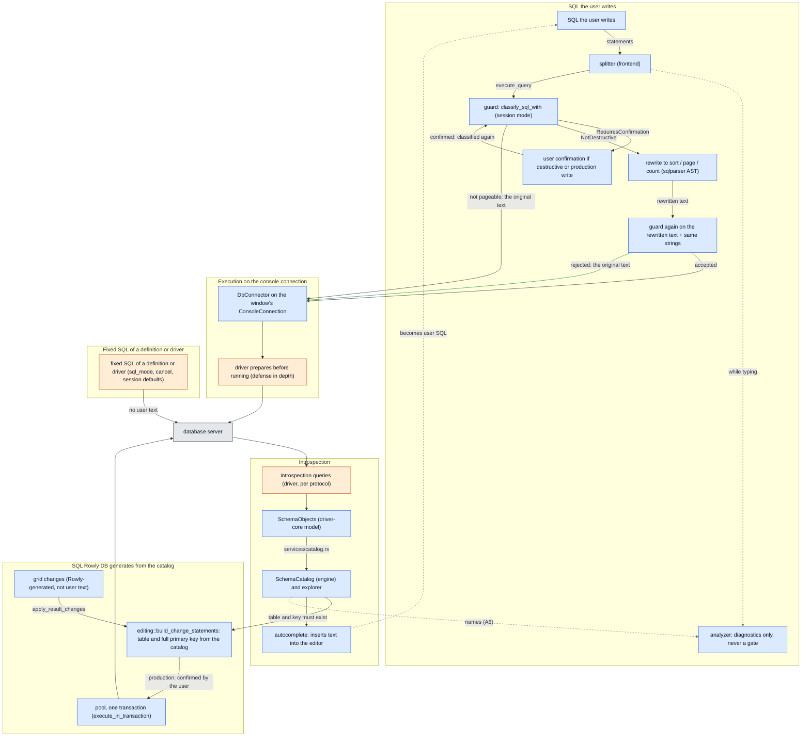

# Arquitectura

[English](ARCHITECTURE.md) · **Español**

Rowly DB es la app. Khipu es su motor, por eso los crates se llaman `khipu-*`.

Este documento explica cómo está construido Rowly DB y dónde puede vivir cada tipo de código. Las obligaciones de calidad del SQL (qué probar y en qué versiones) están en [SQL_ENGINE.es.md](../SQL_ENGINE.es.md); añadir o cambiar un motor de base de datos, en [ENGINE_GUIDE.es.md](../ENGINE_GUIDE.es.md).

## La idea

El núcleo (`khipu-engine`) parsea SQL, lo clasifica antes de ejecutarlo, mantiene el catálogo del esquema y arma sugerencias sin saber nada de Tauri, de Svelte, de un driver ni de una base de datos concreta. Todo lo que cambia de una base a otra se **declara** en un único sitio por motor, y el código compartido se lo pregunta:

- las reglas SQL de un motor, en su `EngineDefinition` (Rust) y en su perfil (TypeScript);
- lo que cambia entre versiones del servidor, como **datos** en `support/<engine>.json`;
- el protocolo de red, en un driver que implementa `DbConnector`.

El código compartido nunca compara nombres de motor. Lo exigen tests (ver [Fronteras que se comprueban solas](#fronteras-que-se-comprueban-solas)).

## Cinco cosas que no son lo mismo

| Concepto | Qué es | Dónde vive | Ejemplo |
| :--- | :--- | :--- | :--- |
| **Motor** | La identidad que elige un perfil de conexión, con sus reglas SQL | `Dialect` (`crates/engine/src/lib.rs`), id `mysql` / `mariadb` / `postgres` | `Dialect::MariaDb` |
| **Dialecto** (reglas SQL) | Cómo escribe y lee SQL el motor: parser, comillas, cadenas, comentarios, cuerpos de rutinas, lo que el guard tiene que saber | `EngineDefinition` (`crates/engine/src/dialects/<engine>.rs`) y `SqlProfile` (`app/src/lib/engines/<engine>.ts`) | MariaDB reutiliza el parser MySQL de sqlparser, pero tiene su propia definición: también ejecuta `/*M! … */` y tiene sus propias líneas |
| **Driver de protocolo** | Transporte, TLS, tipos, consultas al catálogo | Un crate en `crates/drivers/<protocolo>` que implementa `DbConnector` | `khipu-driver-mysql` sirve a MySQL y a MariaDB |
| **Versión exacta del servidor** | Lo que informa el servidor conectado | `ServerIdentity` (`crates/driver-core`): el motor que el driver *detectó* y los números de su versión | `11.8.9-MariaDB` → motor `mariadb`, `[11, 8, 9]` |
| **Línea de comportamiento** | Un rango de versiones que se comportan igual para Rowly DB | Una `line` de `support/<engine>.json`, elegida por `EngineLines::effective` | `11.7` (MariaDB 11.7 en adelante) |

**MariaDB no es MySQL.** Comparten protocolo, así que comparten driver. No comparten motor: MariaDB tiene su propia variante de `Dialect`, su `EngineDefinition`, su perfil, sus líneas, sus versiones verificadas y sus fixtures de línea (`tests/sql/mariadb/`); reutiliza el corpus común de MySQL solo donde un test demuestra que aplica. Compartir un parser o un protocolo nunca autoriza a compartir reglas del guard, comillas, introspección ni capacidades sin tests.

El motor del perfil y el motor detectado pueden no coincidir (un perfil «MySQL» que apunta a un servidor MariaDB). `ConnectionEngineContext` guarda los dos: la línea sale del motor detectado, y el análisis la aplica solo cuando ambos son el mismo motor (`engine_context.rs`).

## Capas y dependencias

Quién puede depender de quién. El grafo **se genera desde el código** con `tools/architecture/graph.mjs`: cada flecha es un `use`, un `mod`, un `include_str!`, un import o una llamada de Tauri reales. La herramienta falla en CI si aparece una flecha que `tools/architecture/model.json` no permite, así que este dibujo no puede separarse del código.

Azul es código compartido, naranja es código de un motor, verde son datos versionados, gris son pruebas y herramientas. Una flecha punteada lee datos.

<!-- generated: dependencies (tools/architecture/graph.mjs) -->

<!-- /generated: dependencies -->

<!-- generated: infrastructure (tools/architecture/graph.mjs) -->
| Tests and tooling | Depend on |
| :--- | :--- |
| Real-server harness (crates/server-tests) | Driver contract (khipu-driver-core); Engine core (khipu-engine); Matrix, evidence, packs, inventory (tools/); MySQL protocol driver (MySQL, MariaDB); PostgreSQL protocol driver; support/*.json (version lines); tests/sql (corpus, coverage.json); tools/test-dbs/lines.json (test servers, verified) |
| Matrix, evidence, packs, inventory (tools/) | Frontend (Svelte); support/*.json (version lines); tests/engines/contract.json; tests/sql (corpus, coverage.json); tools/support/vendor-support.json (vendor dates); tools/test-dbs/lines.json (test servers, verified) |
| CI (.github/workflows) | Matrix, evidence, packs, inventory (tools/); Real-server harness (crates/server-tests); support/*.json (version lines); tests/sql (corpus, coverage.json); tools/test-dbs/lines.json (test servers, verified) |
<!-- /generated: infrastructure -->

Reglas que muestra el grafo:

1. **El código compartido llega a un motor solo por su registro.** `Dialect::definition()` (el único `match` sobre motores del núcleo), `DatabaseKind` y la fábrica de drivers en `app/src-tauri/src/drivers.rs` (el único archivo del backend que nombra un driver concreto), y `ENGINES` / `connectionDrivers` en el frontend.
2. **El núcleo no depende de nada nuestro.** `khipu-engine` no conoce ningún driver, ni siquiera `driver-core`. `khipu-driver-core` tampoco depende de nada.
3. **Los drivers leen el núcleo solo por los datos de línea** (`khipu_engine::lines`: desde qué versión existe cada capacidad del catálogo), nunca por reglas del guard.
4. **El frontend habla con el backend solo mediante comandos de Tauri**, cada uno con un único módulo dueño (`app/src/lib/backend.test.ts`).
5. **Los datos versionados se leen, no se copian.** Cada definición incrusta `support/<engine>.json` y cada perfil lo importa; el backend incrusta `tools/test-dbs/lines.json` y `tools/support/vendor-support.json` para mostrar la verificación y el soporte del fabricante.

No hay un grafo objetivo distinto de este: la estructura de dependencias ya coincide con el diseño buscado. La deuda que queda está dentro de las cajas, no entre ellas (ver [Límites conocidos](#límites-conocidos)).

## Cómo fluye el SQL

Generado desde el mismo modelo. Cada caja apunta a un símbolo real (`anchor` en `model.json`), y la herramienta falla si desaparece.

<!-- generated: sql-flow (tools/architecture/graph.mjs) -->

<!-- /generated: sql-flow -->

Se lee como tres caminos:

**El SQL que escribe el usuario** (el editor, el historial, una pestaña de tabla, un filtro, una sugerencia una vez insertada). El frontend divide la consola en sentencias; el analizador solo dibuja diagnósticos y nunca decide nada. La ejecución va al backend, donde decide el **guard** (`classify_sql_with`, con el modo de la sesión): rechaza, pide confirmación (sentencias destructivas, toda escritura en producción; el backend vuelve a clasificar el texto confirmado) o acepta. Para ordenar, paginar o contar, el backend **reescribe** la sentencia aceptada (`khipu_engine::pagination`). Lo que llega al servidor es ese texto reescrito, así que tiene que leerse de vuelta con las mismas cadenas y volver a pasar el guard; si no, corre el texto original. Nada transformado después del guard se ejecuta sin ese segundo control. Después el driver lo ejecuta en la conexión de consola de la ventana, y antes lo prepara: una defensa en profundidad en la que el guard no se apoya (SQL_ENGINE §8).

**El SQL que Rowly DB genera desde el catálogo.** Aplicar cambios del grid no ejecuta texto del usuario, así que no pasa por el guard. `editing::build_change_statements` escribe el `UPDATE`/`INSERT`/`DELETE` solo para una tabla del catálogo cargado, por su clave primaria completa, con las comillas del motor y las reglas de literales de la sesión; en producción, solo tras la confirmación del usuario; en el pool, en una transacción.

**El SQL fijo de una definición o de un driver.** Leer el modo de la sesión (`sql_mode_query`), cancelar, los valores por defecto de la sesión y las consultas al catálogo son constantes de su dueño, sin texto del usuario.

**La introspección** va en sentido contrario: cada driver consulta el catálogo de su servidor con las capacidades de su línea y llena el modelo compartido `SchemaObjects`; el backend lo convierte en el `SchemaCatalog` del núcleo (`services/catalog.rs`), que alimenta el autocompletado y la comprobación de nombres. Lo que inserta el autocompletado pasa a ser SQL del usuario.

## Dónde puede vivir el código de un motor

| Regla | Dueño |
| :--- | :--- |
| Identidad del motor y registro | `Dialect`, `ALL`, `definition()` en `crates/engine/src/lib.rs` |
| Parser, comillas, cadenas, comentarios, cuerpos de rutinas, reglas del SQL generado, lo que el guard tiene que saber | Su `EngineDefinition`. Un mecanismo que necesita un motor pasa a ser un campo de la definición, que usa el código compartido; nunca un `if` sobre el motor |
| Lo que cambia entre versiones (capacidades, palabras reservadas, sintaxis eliminada) | Datos en `support/<engine>.json`. Nunca código |
| Protocolo, TLS, tipos de columna, consultas al catálogo | El driver de su protocolo |
| Perfil de conexión, logo, puerto por defecto | `app/src/lib/connections.ts` |
| Perfil del editor (léxico, comillas, errores, funciones integradas) | `app/src/lib/engines/<engine>.ts`; `tests/engines/contract.json` fija lo que tiene que coincidir con Rust |
| Perfil → motor → driver en el backend | `app/src-tauri/src/drivers.rs` |
| Servidores de prueba y versiones verificadas | `tools/test-dbs/lines.json`, con el corpus en `tests/sql/<engine>/` |
| Fechas de soporte del fabricante | `tools/support/vendor-support.json` (solo se muestran) |

Todos los drivers se compilan dentro de la app. No hay features de Cargo para dejar uno fuera.

## Fuentes de verdad

Cada dato tiene un dueño. Donde una copia es inevitable, un test la mantiene igual.

| Concepto | Dueño (fuente) | Consumidores | Copias y su protección |
| :--- | :--- | :--- | :--- |
| Ids de motor | `Dialect::ALL` | backend, drivers, tests | `DatabaseKind`, `Engine` (server-tests), `ConnectionDriver` y `ENGINES` (frontend), `tests/engines/contract.json`: un test compara cada uno con `Dialect::ALL` |
| Versión exacta | El servidor, leído por su driver (`ServerIdentity`) | `ConnectionEngineContext` | ninguna |
| Línea, revisión, capacidades, palabras reservadas, sintaxis eliminada | `support/<engine>.json`, parseado por `khipu_engine::lines` | drivers (capacidades), analizador (sintaxis eliminada), SQL generado y perfiles del frontend (reservadas), contexto (línea, revisión) | Ids de línea en `lines.json` (`crates/engine/tests/lines.rs`); un paquete descargado reemplaza una línea solo con una revisión mayor |
| Piso de compatibilidad | `COMPATIBILITY_FLOOR_*` en el `version.rs` de cada driver | el aviso del explorador | Igual al inicio de la primera línea (`the_floor_is_where_the_first_line_starts`) |
| Estado de soporte del fabricante | `tools/support/vendor-support.json` | contexto | `tools/test-dbs/window.mjs` aplica la misma regla de ventana en CI |
| Versiones verificadas | `verified` en `tools/test-dbs/lines.json`, fijadas por digest | contexto («verificada»), la matriz (`sql-engine.yml`), la evidencia | Las imágenes de `e2e.yml` y `docker-compose.yml` se comparan con ella (`crates/server-tests`) |
| Cobertura de cada fila S/A/G/D | `tests/sql/coverage.json` | `tools/inventory/coverage.mjs` | Cada test contra servidor real tiene que probar una fila |
| Dependencias | `Cargo.lock`, `app/package-lock.json` | builds | `tools/inventory/dependencies.mjs`: solo crates.io y registry.npmjs.org |

## Fronteras que se comprueban solas

| Regla | Test |
| :--- | :--- |
| El núcleo no nombra ni compara motores | `ningun_modulo_del_nucleo_compara_motores` (`crates/engine/src/lib.rs`) |
| El backend nombra motores solo en su registro | `solo_el_registro_nombra_un_motor_concreto` (`app/src-tauri/src/drivers.rs`) |
| El frontend nombra motores solo en sus perfiles y en el registro de conexiones | `solo el perfil y el registro de conexiones nombran un motor concreto` (`app/src/lib/engines/contract.test.ts`) |
| El frontend nunca deduce una línea ni una versión | `el frontend no deduce linea ni version` (mismo archivo) |
| Un motor nuevo no puede caer en silencio en las pruebas de otro | Cada `match` sobre `Engine` de `crates/server-tests` es exhaustivo |
| Los drivers no comparan versiones por su cuenta | `no_known_consumer_declares_versioned_behavior_by_itself_again` (`crates/engine/tests/lines.rs`) |
| Los paquetes nunca llegan al guard | `k_the_guard_reads_no_line_data` (`app/src-tauri/src/support.rs`) |
| Un solo camino para ejecutar SQL, un dueño por comando | `app/src/lib/workspace/executionSession.test.ts`, `app/src/lib/backend.test.ts` |
| El grafo de dependencias coincide con el permitido | `tools/architecture/graph.mjs --check` |
| Solo versiones publicadas de las dependencias | `tools/inventory/dependencies.mjs` |

## Reglas de la app

1. **Un dueño por cada pieza de estado.** La conexión, el catálogo, la ejecución, las pestañas y el documento del editor viven en lapsos distintos. Un módulo lee el estado de otro mediante su interfaz; no guarda una segunda copia mutable.
2. **Un solo camino para ejecutar SQL.** Editor, historial, tabla y paginación pasan por la misma clasificación, confirmación y ejecución. La UI nunca decide si una sentencia es segura: lo decide el guard del backend.
3. **Las dependencias apuntan en un sentido:** componentes Svelte → casos de uso → stores y contratos del dominio → adaptadores de Tauri y SQL.
4. **Trabajo proporcional a lo visible.** El grid es una ventana virtual; el editor analiza lo que cambia. Abrir pestañas o dejar la app abierta no multiplica listeners, cachés ni consultas.
5. **Los costos opcionales los paga quien los activa.** Sin una extensión activa no se carga su código, no arranca ningún worker y no se consulta ningún store.

### Backend (`app/src-tauri/src`)

| Ruta | Qué hace |
| :--- | :--- |
| `lib.rs` | Arma la app y registra los comandos. Nada más. |
| `drivers.rs` | El registro de motores del backend: perfil → `Dialect` → driver. |
| `state.rs` | `AppState`: un `ActiveConnection` por ventana, con su conector, su catálogo compartido (`Arc<SchemaCatalog>`, que solo se reconstruye cuando cambian los schemas) y las consultas que se pueden cancelar. |
| `engine_context.rs` | El contexto de motor de cada conexión, armado una vez al conectar: generación, motor, servidor detectado, modo de la sesión, línea efectiva y su revisión, `schemaEpoch`, soporte del fabricante y verificación. El frontend lo recibe de solo lectura. |
| `support.rs` | Paquetes de soporte de versiones (SQL_ENGINE §11): índice y paquetes firmados, instalación atómica, quitar y desactivar, y las líneas activas de cada motor. Red solo cuando el usuario lo pide. |
| `commands/` | Un archivo por dominio (`query`, `catalog`, `connection`, `files`, `results`). Cada comando adapta sus argumentos y llama a lo que ya existe; nunca repite el guard, el catálogo ni los pools. |
| `services/` | Lo que hacen los comandos, sin Tauri: el catálogo del núcleo, los textos de consola, los archivos `.sql`, exportar y editar resultados. |
| `terminal.rs` | La terminal integrada: es dueño de cada PTY y su shell (ver [Terminal integrada](#terminal-integrada)). |

### Frontend (`app/src/lib`)

| Ruta | Qué hace |
| :--- | :--- |
| `workspace/` | La sesión de ejecución (preparar, confirmar, ejecutar, cancelar, registrar), las pestañas de resultados, los cambios del grid, guardar y cerrar consolas, el registro de comandos y los parámetros. |
| `editor/` | Todo lo de CodeMirror: configuración, análisis mientras se escribe, diagnósticos, comandos, autocompletado, contexto del cursor, comentarios, formato. El análisis no depende del DOM. |
| `results/` | El grid: ventana virtual, selección, búsqueda, orden, filtros, portapapeles, tipos de celda y edición. |
| `connections/` | Los errores y la identidad de una conexión, su prueba y el árbol del explorador. |
| `engines/` | El perfil de cada motor y `engineForContext`, que le aplica el modo de la sesión y las reservadas de la línea. |
| `stores/` | Estado compartido, cada uno con un dueño: conexión y catálogo (`connection.ts`), consolas (`queryConsoles.ts`), borradores del grid (`resultEdits.ts`), historial, ajustes. |
| `terminal.ts`, `components/Terminal.svelte`, `components/TerminalSession.svelte` | La terminal (sus sesiones y cada shell con su xterm) y su IPC; se cargan la primera vez que se abre. |

`SqlEditor.svelte` y `Workspace.svelte` solo componen: montan lo que dan estas carpetas y traducen eventos.

### Quién es dueño de cada estado

| Estado | Dueño | Se invalida |
| :--- | :--- | :--- |
| Conexión | `ActiveConnection` en el backend; `stores/connection.ts` en el frontend | Al volver a la lista (`disconnect`) o cerrar la ventana |
| Motor, versión y modo | `ConnectionEngineContext` | Nunca cambia: reconectar crea una generación nueva |
| Líneas activas y paquetes de soporte | `support.rs` (`Dialect::activate_lines`); `stores/supportPackages.ts` los llama (por ahora sin pantalla) | Al instalar, quitar o desactivar; cada conexión conserva las que tomó al conectar |
| Catálogo | `ActiveConnection.catalog`; `catalogTables` y `databaseExplorer` en el frontend | Cada cambio de esquema sube `schemaEpoch` |
| Caché del análisis | `editor/analysisSession.ts`, una a la vez | Otra generación, `schemaEpoch`, motor o conjunto de tablas que crea el documento; `analyze_sql` rechaza pedidos hechos con otro contexto |
| Consolas y su texto | `stores/queryConsoles.ts` | Al cerrar la consola |
| Borradores del grid | `stores/resultEdits.ts` | Al aplicar, revertir o cerrar la pestaña |
| Terminal: PTY y shell | `AppState.terminals` en el backend; el buffer de la salida es el de xterm | Al cerrar la sesión, `exit` en el shell, cerrar la ventana o salir de la app |

Cada comando del backend tiene un único módulo del frontend que lo invoca, fijado por `app/src/lib/backend.test.ts`: el SQL solo se ejecuta desde `queryExecution.ts` (al que solo llama `workspace/executionSession.ts`). Un comando nuevo entra en esa tabla con su dueño. `app/src-tauri/src/lib.rs` comprueba que lo registrado es exactamente lo que invoca el frontend.

### Recursos

Lo que se repite no deja nada atrás: 300 reconexiones alternando motores, 300 ciclos de abrir, ejecutar y cerrar consolas con cambio de tema, la terminal en el lugar del grid (sin consola, al cambiar de consola, con `Ctrl+T` y con varias sesiones), 300 ciclos de abrir y cerrar una sesión (cada shell recogido y el backend de vuelta a sus hilos), reposo con una conexión abierta y con 1, 5 y 10 sesiones, y 50 MB de salida en la terminal más `yes` durante 30 s con la interfaz respondiendo y la memoria acotada. `app/tests/e2e/resources.mjs` lo comprueba en cada PR con el heap vivo de JavaScript, el backend y el DOM ([tools/bench/README.es.md](../tools/bench/README.es.md#ciclos-de-recursos)).

### Terminal integrada

Un shell para el trabajo propio del usuario, fuera del camino del SQL: no pasa por el guard, y Rowly nunca le escribe ni le pasa credenciales. Al shell solo llega lo que el usuario teclea.

- **Dueño.** `terminal.rs` es dueño de cada PTY y su shell (`portable-pty`); el frontend solo conoce un id, y el id pertenece a la ventana que lo abrió: otra ventana no puede escribirle, cambiarle el tamaño, confirmarle salida ni cerrarla. Comandos: `create_terminal`, `write_terminal`, `resize_terminal`, `ack_terminal`, `close_terminal`. La salida viaja en bytes por un `Channel` y el código de salida por otro; xterm decodifica el UTF-8 de forma incremental, así que un carácter partido entre dos lecturas llega entero.
- **Ciclo de vida.** Cada terminal tiene dos hilos dormidos en llamadas bloqueantes, sin sondeos: el lector (`read` → salida) y el que espera (`wait` → quita la sesión → salida del shell). Esperar aparte de leer recoge siempre el shell, aunque un proceso separado deje el PTY abierto o ConPTY no dé fin de lectura. Cerrar manda primero `SIGHUP` (en Windows, `TerminateProcess`), espera hasta 500 ms y solo después suelta el PTY: al soltarse, el writer de portable-pty manda un salto de línea y un EOF, que ejecutarían lo que quedó escrito en el prompt. Una ventana destruida cierra sus terminales; `RunEvent::Exit` las cierra todas, porque con `panic = "abort"` no corre ningún `Drop` del estado. El shell es líder de sesión y el cuelgue llega a sus trabajos; lo que el usuario separó a propósito (`nohup`, `disown`, `setsid`) sobrevive. portable-pty cierra en el hijo los descriptores heredados: el shell no recibe los sockets de base de datos de Rowly.
- **Control de flujo.** El frontend confirma lo que xterm ya procesó de a 64 KiB; el lector se detiene con 1 MiB sin confirmar, el PTY se llena y el kernel frena al programa que escribe. Sin esto, `yes` hacía crecer el backend unos 80 MB/s y, al pasar xterm de 50 MB pendientes, la terminal quedaba parada para siempre.
- **Shell y entorno.** Linux y macOS: `$SHELL` si es ejecutable, si no el de passwd, si no `/bin/sh`, como shell de login. Windows: `pwsh.exe`, si no `powershell.exe` (los dos con `-NoLogo`), si no `%ComSpec%`. El entorno es el de la app más `TERM=xterm-256color` y `COLORTERM=truecolor`; `WEBKIT_DISABLE_DMABUF_RENDERER` se quita solo si la puso Rowly. Dentro de una AppImage, AppRun apunta `PYTHONHOME`, `LD_LIBRARY_PATH`, `GTK_PATH`, `PATH`… a la carpeta montada de la app (con eso `python3` no arrancaba): de cada variable se quitan esas entradas y, si no queda ninguna, la variable. Arranca en la carpeta SQL del perfil o en `HOME`.
- **Pestaña y sesiones.** La terminal es de la ventana, no de una consola: la pestaña `>_ Terminal` va aparte, a la derecha de la fila del panel inferior (`ResultPane`), con Salida fija a la izquierda y los resultados desplazándose entre ambas (acción `tabScroll`). Abierta, ocupa el lugar de la barra y del cuerpo del resultado, que quedan montados y ocultos (el grid conserva su estado); no hay otro panel ni otro splitter. Sigue a la vista al cambiar de consola, salvo al abrir o pasar a una pestaña de tabla (sus datos son todo lo que muestra; la terminal se oculta y vuelve con `Ctrl+T`), y funciona sin ninguna abierta. `Ctrl+T` la abre y, otra vez, vuelve a la pestaña que la consola tenía; elegir una pestaña del resultado o ejecutar desde el editor también vuelven. Las pestañas del panel inferior son una sola pieza en estilo carpeta (`styles/tabs.css`): la elegida toma el color de lo que muestra debajo y se une a él. Dentro, las sesiones (`Local`, `Local (2)`…) son como las pestañas de las consolas y se renombran con doble clic, `F2` o `Ctrl+Shift+R`: `+` abre otra y `×` cierra solo esa; cerrar la última deja la pestaña. Con el foco dentro, todas las teclas son del shell y de las IA salvo `Ctrl+T`, `Ctrl+Shift+Alt+flechas` (cambiar de zona), `Ctrl+Tab`, `Ctrl+Shift+Tab` y `Ctrl+1…9` (sesiones), `Ctrl+Shift+T/W/R` (nueva, cerrar, renombrar), `Ctrl+Shift+C/V` (copiar, pegar) y `Ctrl+?` (hoja de atajos). Están apiladas en el mismo lugar y solo cambia cuál se ve (`visibility`), así que cambiar de sesión no re-mide ni re-pinta xterm. `Terminal.svelte` (y con él xterm) se carga la primera vez que se abre, así que el arranque no lo lleva ni se crea un shell. Cada sesión (`TerminalSession.svelte`) es un shell con su xterm; las ocultas siguen vivas, sin timers. Ningún store guarda la salida: el buffer es el de xterm, con 5000 líneas de scrollback (unos 7 MB llenas a 120 columnas); los colores salen de `editorPalette`, el cursor no parpadea y el cambio de tamaño llega al backend solo si cambian columnas o filas.

## `khipu-lsp`

`crates/engine-lsp` es un **esqueleto**: responde a `initialize` y `shutdown`, no anuncia capacidades y devuelve una lista de completado vacía. Todavía no llama al núcleo (solo depende del crate). El núcleo está hecho para correr fuera de la app, pero hoy no hay un servidor de lenguaje que funcione.

## Los grafos de este repositorio

- **El grafo de arquitectura de arriba** es el canónico: generado desde el código, comprobado en CI, con la parte semántica (dominios, flechas permitidas, anclas del flujo SQL) en `tools/architecture/model.json`. Cambia el modelo cuando cambie el diseño; nunca edites los bloques generados.
- **`graphify-out/`** es un grafo fino de símbolos (miles de nodos) para explorar el código: `graphify query "<pregunta>"`, `graphify path "A" "B"`. Se regenera con `graphify update .` (AST, sin LLM para el código) y no es evidencia de CI: la herramienta no forma parte del build, sus aristas de llamada se resuelven por nombre, así que te llevan al código pero no demuestran una dependencia (un grafo anterior a esta reorganización mostraba `driver-postgres → driver-mysql`, que ningún código hace), no ve archivos de datos ni el flujo en ejecución, y su frescura es el commit que registra (`built_at_commit`). Úsalo para encontrar código; usa este documento y su grafo generado para conocer las reglas.

## Límites conocidos

Lo que la arquitectura todavía no decide. Cada uno es un hueco deliberado, no una invitación a rodearlo:

- **Motores embebidos.** `ConnectionConfig` (`crates/driver-core`) supone un servidor de red: host, puerto, usuario, contraseña y TLS. Lo mismo el formulario de conexión, los perfiles guardados y `TlsStatus`. Un motor sin proceso servidor (SQLite) necesita una decisión de arquitectura antes de su driver; ver [ENGINE_GUIDE.es.md](../ENGINE_GUIDE.es.md#motores-embebidos).
- **`Capability` es un enum cerrado** (`crates/engine/src/lines.rs`): una capacidad nueva del catálogo es un cambio del núcleo.
- **Código de mecanismo con nombre de motor.** Algunas funciones compartidas de `diagnostics.rs` y `execution_guard.rs` se llaman `mysql_*` / `postgres_*`; se activan por mecanismo (`RoutineBodies::Block`, `Quoted`, `select_into_variable_lists`), no por motor. Un tercer motor con otro mecanismo añade una variante, no una rama.
- **Las palabras reservadas base** viven en una lista compartida de `crates/engine/src/editing.rs` y en cada perfil de TypeScript; entre ellas solo se comparten los datos de línea.
