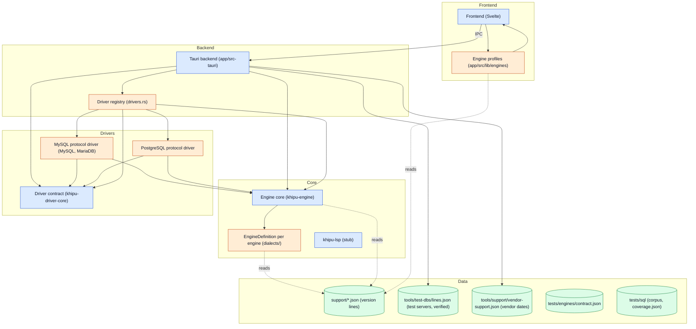
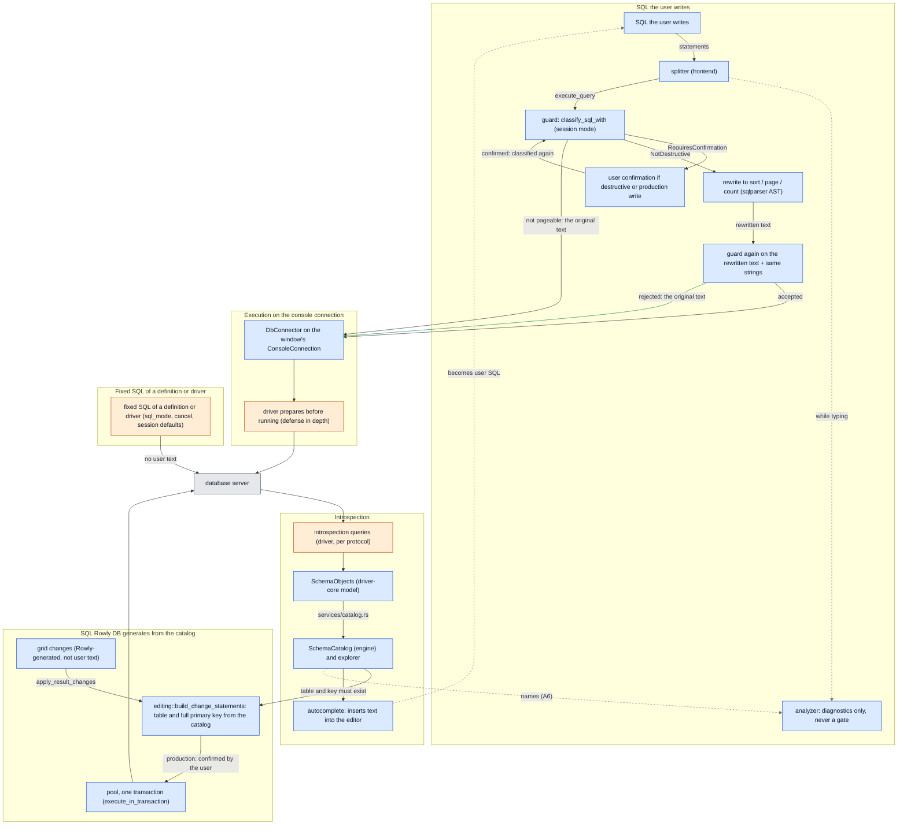

# Architecture

**English** · [Español](ARCHITECTURE.es.md)

Rowly DB is the app. Khipu is its engine, which is why the crates are named `khipu-*`.

This document explains how Rowly DB is built and where each kind of code is allowed to live. Quality obligations for SQL (what to test, on which versions) are in [SQL_ENGINE.md](../SQL_ENGINE.md); adding or changing a database engine is in [ENGINE_GUIDE.md](../ENGINE_GUIDE.md).

## The idea

The core (`khipu-engine`) parses SQL, classifies it before it runs, keeps the schema catalog and builds suggestions without knowing about Tauri, Svelte, a driver or any particular database. Everything that differs from one database to another is **declared** in one place per engine and asked for by the shared code:

- the SQL rules of an engine in its `EngineDefinition` (Rust) and its profile (TypeScript);
- what changes between server versions as **data** in `support/<engine>.json`;
- the wire protocol in a driver that implements `DbConnector`.

Shared code never compares engine names. Tests enforce it (see [Boundaries that check themselves](#boundaries-that-check-themselves)).

## Five things that are not the same

| Concept | What it is | Where it lives | Example |
| :--- | :--- | :--- | :--- |
| **Engine** | The identity a connection profile picks, with its SQL rules | `Dialect` (`crates/engine/src/lib.rs`), id `mysql` / `mariadb` / `postgres` | `Dialect::MariaDb` |
| **Dialect** (SQL rules) | How the engine writes and reads SQL: parser, quoting, strings, comments, routine bodies, what the guard must know | `EngineDefinition` (`crates/engine/src/dialects/<engine>.rs`) and `SqlProfile` (`app/src/lib/engines/<engine>.ts`) | MariaDB reuses sqlparser's MySQL parser but has its own definition: it also runs `/*M! … */` and has its own lines |
| **Protocol driver** | Transport, TLS, types, catalog queries | A crate in `crates/drivers/<protocol>` implementing `DbConnector` | `khipu-driver-mysql` serves both MySQL and MariaDB |
| **Exact server release** | What the connected server reports | `ServerIdentity` (`crates/driver-core`): the engine the driver *detected* and its version numbers | `11.8.9-MariaDB` → engine `mariadb`, `[11, 8, 9]` |
| **Behavior line** | A range of releases that behave the same for Rowly DB | A `line` of `support/<engine>.json`, chosen by `EngineLines::effective` | `11.7` (MariaDB 11.7 and later) |

**MariaDB is not MySQL.** They share a protocol, so they share a driver. They do not share an engine: MariaDB has its own `Dialect` variant, `EngineDefinition`, profile, lines, verified releases and line fixtures (`tests/sql/mariadb/`); it reuses MySQL's common corpus only where a test proves it applies. Sharing a parser or a protocol never authorizes sharing guard rules, quoting, introspection or capabilities without tests.

The profile's engine and the detected engine can differ (a "MySQL" profile pointed at a MariaDB server). `ConnectionEngineContext` keeps both: the line comes from the detected engine, and the analysis applies it only when both are the same engine (`engine_context.rs`).

## Layers and dependencies

Who may depend on whom. The graph is **generated from the code** by `tools/architecture/graph.mjs`: every arrow is a real `use`, `mod`, `include_str!`, import or Tauri call. The tool fails in CI if an arrow appears that `tools/architecture/model.json` does not allow, so this picture cannot drift from the code.

Blue is shared code, orange is code of one engine, green is versioned data, grey is tests and tooling. A dotted arrow reads data.

<!-- generated: dependencies (tools/architecture/graph.mjs) -->

<!-- /generated: dependencies -->

<!-- generated: infrastructure (tools/architecture/graph.mjs) -->
| Tests and tooling | Depend on |
| :--- | :--- |
| Real-server harness (crates/server-tests) | Driver contract (khipu-driver-core); Engine core (khipu-engine); Matrix, evidence, packs, inventory (tools/); MySQL protocol driver (MySQL, MariaDB); PostgreSQL protocol driver; support/*.json (version lines); tests/sql (corpus, coverage.json); tools/test-dbs/lines.json (test servers, verified) |
| Matrix, evidence, packs, inventory (tools/) | Frontend (Svelte); support/*.json (version lines); tests/engines/contract.json; tests/sql (corpus, coverage.json); tools/support/vendor-support.json (vendor dates); tools/test-dbs/lines.json (test servers, verified) |
| CI (.github/workflows) | Matrix, evidence, packs, inventory (tools/); Real-server harness (crates/server-tests); support/*.json (version lines); tests/sql (corpus, coverage.json); tools/test-dbs/lines.json (test servers, verified) |
<!-- /generated: infrastructure -->

Rules the graph shows:

1. **Shared code reaches an engine only through its registry.** `Dialect::definition()` (the one `match` on engines in the core), `DatabaseKind` and the driver factory in `app/src-tauri/src/drivers.rs` (the only backend file that names a concrete driver), and `ENGINES` / `connectionDrivers` in the frontend.
2. **The core depends on nothing of ours.** `khipu-engine` knows no driver, not even `driver-core`. `khipu-driver-core` depends on nothing either.
3. **Drivers read the core only for line data** (`khipu_engine::lines`: since which release each catalog capability exists), never for guard rules.
4. **The frontend talks to the backend only through Tauri commands**, each with a single owner module (`app/src/lib/backend.test.ts`).
5. **Versioned data is read, not copied.** `support/<engine>.json` is embedded by each definition and imported by each profile; `tools/test-dbs/lines.json` and `tools/support/vendor-support.json` are embedded by the backend to show verification and vendor support.

There is no target graph different from this one: the dependency structure already matches the intended design. What remains as debt is inside the boxes, not between them (see [Known limits](#known-limits)).

## How SQL flows

Generated from the same model. Each box points to a real symbol (`anchor` in `model.json`), and the tool fails if it disappears.

<!-- generated: sql-flow (tools/architecture/graph.mjs) -->

<!-- /generated: sql-flow -->

Read it as three paths:

**SQL the user writes** (the editor, history, a table tab, a filter, a suggestion once inserted). The frontend splits the console into statements; the analyzer only draws diagnostics and never decides anything. Execution goes to the backend, where the **guard** (`classify_sql_with`, with the session mode) decides: it rejects, asks for confirmation (destructive statements, every write in production; the backend classifies the confirmed text again) or accepts. To sort, page or count, the backend **rewrites** the accepted statement (`khipu_engine::pagination`). That rewritten text is what reaches the server, so it must read back with the same strings and pass the guard again; if not, the original text runs. Nothing transformed after the guard runs without that second check. The driver then runs it on the window's console connection, and prepares it first: a defense in depth the guard does not rely on (SQL_ENGINE §8).

**SQL Rowly DB generates from the catalog.** Applying grid changes does not run user text, so it does not go through the guard. `editing::build_change_statements` writes the `UPDATE`/`INSERT`/`DELETE` only for a table of the loaded catalog, by its complete primary key, with the engine's quoting and the session's literal rules; in production only after the user confirms; on the pool, in one transaction.

**Fixed SQL of a definition or driver.** Reading the session mode (`sql_mode_query`), cancelling, session defaults and the catalog queries are constants of their owner, with no user text.

**Introspection** goes the other way: each driver queries its server's catalog with the capabilities of its line and fills the shared `SchemaObjects` model; the backend turns it into the engine's `SchemaCatalog` (`services/catalog.rs`), which feeds autocomplete and name checks. What autocomplete inserts is user SQL from then on.

## Where engine-specific code may live

| Rule | Owner |
| :--- | :--- |
| Engine identity and registry | `Dialect`, `ALL`, `definition()` in `crates/engine/src/lib.rs` |
| Parser, quoting, strings, comments, routine bodies, generated SQL rules, what the guard must know | Its `EngineDefinition`. A mechanism one engine needs becomes a field of the definition, used by shared code, never an `if` on the engine |
| What changes between versions (capabilities, reserved words, removed syntax) | Data in `support/<engine>.json`. Never code |
| Protocol, TLS, column types, catalog queries | The driver of its protocol |
| Connection profile, logo, default port | `app/src/lib/connections.ts` |
| Editor profile (lexing, quoting, errors, built-in functions) | `app/src/lib/engines/<engine>.ts`; `tests/engines/contract.json` pins what must match Rust |
| Backend profile → engine → driver | `app/src-tauri/src/drivers.rs` |
| Test servers and verified releases | `tools/test-dbs/lines.json`, with the corpus in `tests/sql/<engine>/` |
| Vendor support dates | `tools/support/vendor-support.json` (display only) |

Every driver is compiled into the app. There are no Cargo features to leave one out.

## Sources of truth

Each fact has one owner. Where a copy is unavoidable, a test keeps it equal.

| Concept | Owner (source) | Consumers | Copies and their protection |
| :--- | :--- | :--- | :--- |
| Engine ids | `Dialect::ALL` | backend, drivers, tests | `DatabaseKind`, `Engine` (server-tests), `ConnectionDriver` and `ENGINES` (frontend), `tests/engines/contract.json`: each compared with `Dialect::ALL` by a test |
| Exact release | The server, read by its driver (`ServerIdentity`) | `ConnectionEngineContext` | none |
| Behavior line, revision, capabilities, reserved words, removed syntax | `support/<engine>.json`, parsed by `khipu_engine::lines` | drivers (capabilities), analyzer (removed syntax), generated SQL and frontend profiles (reserved words), context (line, revision) | Line ids in `lines.json` (`crates/engine/tests/lines.rs`); a downloaded pack replaces a line only with a higher revision |
| Compatibility floor | `COMPATIBILITY_FLOOR_*` in each driver's `version.rs` | the explorer warning | Equal to the start of the first line (`the_floor_is_where_the_first_line_starts`) |
| Vendor support status | `tools/support/vendor-support.json` | context | `tools/test-dbs/window.mjs` applies the same window rule in CI |
| Verified releases | `verified` in `tools/test-dbs/lines.json`, pinned by digest | context ("verified"), the matrix (`sql-engine.yml`), evidence | `e2e.yml` and `docker-compose.yml` images are checked against it (`crates/server-tests`) |
| Coverage of each S/A/G/D row | `tests/sql/coverage.json` | `tools/inventory/coverage.mjs` | Every real-server test must prove a row |
| Dependencies | `Cargo.lock`, `app/package-lock.json` | builds | `tools/inventory/dependencies.mjs`: only crates.io and registry.npmjs.org |

## Boundaries that check themselves

| Rule | Test |
| :--- | :--- |
| The core does not name or compare engines | `ningun_modulo_del_nucleo_compara_motores` (`crates/engine/src/lib.rs`) |
| The backend names engines only in its registry | `solo_el_registro_nombra_un_motor_concreto` (`app/src-tauri/src/drivers.rs`) |
| The frontend names engines only in its profiles and connection registry | `solo el perfil y el registro de conexiones nombran un motor concreto` (`app/src/lib/engines/contract.test.ts`) |
| The frontend never derives a line or version | `el frontend no deduce linea ni version` (same file) |
| A new engine cannot silently fall into another one's tests | Every `match` on `Engine` in `crates/server-tests` is exhaustive |
| Drivers do not compare versions by themselves | `no_known_consumer_declares_versioned_behavior_by_itself_again` (`crates/engine/tests/lines.rs`) |
| Packs never reach the guard | `k_the_guard_reads_no_line_data` (`app/src-tauri/src/support.rs`) |
| One path to run SQL, one owner per command | `app/src/lib/workspace/executionSession.test.ts`, `app/src/lib/backend.test.ts` |
| The dependency graph matches the allowed one | `tools/architecture/graph.mjs --check` |
| Only published releases of dependencies | `tools/inventory/dependencies.mjs` |

## Rules for the app

1. **One owner per piece of state.** The connection, the catalog, execution, tabs and the editor document live for different spans. A module reads another's state through its interface; it does not keep a second mutable copy.
2. **One path to run SQL.** Editor, history, table and paging go through the same classification, confirmation and execution. The UI never decides whether a statement is safe: the backend guard does.
3. **Dependencies point one way:** Svelte components → use cases → domain stores and contracts → Tauri and SQL adapters.
4. **Work proportional to what is visible.** The grid is a virtual window; the editor analyzes what changes. Opening tabs or leaving the app open does not multiply listeners, caches or queries.
5. **Optional costs fall on whoever enables them.** With no extension active, no extension code loads, no worker starts and no store is queried.

### Backend (`app/src-tauri/src`)

| Path | What it does |
| :--- | :--- |
| `lib.rs` | Builds the app and registers the commands. Nothing else. |
| `drivers.rs` | The engine registry of the backend: profile → `Dialect` → driver. |
| `state.rs` | `AppState`: one `ActiveConnection` per window, with its connector, its shared catalog (`Arc<SchemaCatalog>`, rebuilt only when the schemas change) and the queries that can be cancelled. |
| `engine_context.rs` | Each connection's engine context, built once on connect: generation, engine, detected server, session mode, effective line and its revision, `schemaEpoch`, vendor support and verification. The frontend gets it read-only. |
| `support.rs` | Version support packs (SQL_ENGINE §11): signed index and packs, atomic install, removing and disabling, and each engine's active lines. Network only when the user asks. |
| `commands/` | One file per domain (`query`, `catalog`, `connection`, `files`, `results`). Each command adapts its arguments and calls what already exists; it never repeats the guard, the catalog or the pools. |
| `services/` | What the commands do, without Tauri: the engine catalog, console texts, `.sql` files, exporting and editing results. |
| `terminal.rs` | The integrated terminal: owns each PTY and its shell (see [Integrated terminal](#integrated-terminal)). |

### Frontend (`app/src/lib`)

| Path | What it does |
| :--- | :--- |
| `workspace/` | The run session (prepare, confirm, run, cancel, log), result tabs, grid changes, saving and closing consoles, the command registry and parameters. |
| `editor/` | Everything CodeMirror: configuration, analysis while typing, diagnostics, commands, autocomplete, cursor context, comments, formatting. Analysis does not depend on the DOM. |
| `results/` | The grid: virtual window, selection, search, sort, filters, clipboard, cell types and editing. |
| `connections/` | A connection's errors and identity, its test and the explorer tree. |
| `engines/` | Each engine's profile and `engineForContext`, which applies the session mode and the line's reserved words to it. |
| `stores/` | Shared state, each with one owner: connection and catalog (`connection.ts`), consoles (`queryConsoles.ts`), grid drafts (`resultEdits.ts`), history, settings. |
| `terminal.ts`, `components/Terminal.svelte`, `components/TerminalSession.svelte` | The terminal (its sessions, each shell with its xterm) and its IPC; loaded the first time it is opened. |

`SqlEditor.svelte` and `Workspace.svelte` only compose: they mount what these folders provide and translate events.

### Who owns each piece of state

| State | Owner | Invalidated |
| :--- | :--- | :--- |
| Connection | `ActiveConnection` in the backend; `stores/connection.ts` in the frontend | On going back to the list (`disconnect`) or closing the window |
| Engine, release and mode | `ConnectionEngineContext` | Never changes: reconnecting creates a new generation |
| Active lines and support packs | `support.rs` (`Dialect::activate_lines`); `stores/supportPackages.ts` calls them (no screen for now) | On install, removal or disabling; each connection keeps the ones it took on connect |
| Catalog | `ActiveConnection.catalog`; `catalogTables` and `databaseExplorer` in the frontend | Every schema change bumps `schemaEpoch` |
| Analysis cache | `editor/analysisSession.ts`, one at a time | Another generation, `schemaEpoch`, engine or set of tables the document creates; `analyze_sql` rejects requests made under another context |
| Consoles and their text | `stores/queryConsoles.ts` | When the console is closed |
| Tiled consoles | `stores/consoleMosaic.ts`, per connection | When the console is closed or taken out of the tiling; consoles that no longer exist are pruned on mount |
| Tiled results | `Workspace.svelte`, in memory per console | When the tab, the console or the app is closed |
| Grid drafts | `stores/resultEdits.ts` | On apply, revert or closing the tab |
| Terminal: PTY and shell | `AppState.terminals` in the backend; the output buffer is xterm's | On closing the session, `exit` in the shell, closing the window or quitting the app |

Each backend command has a single frontend module that invokes it, pinned by `app/src/lib/backend.test.ts`: SQL runs only from `queryExecution.ts` (itself called only by `workspace/executionSession.ts`). A new command goes into that table with its owner. `app/src-tauri/src/lib.rs` checks that what is registered is exactly what the frontend invokes.

### Resources

Whatever repeats leaves nothing behind: 300 reconnections alternating engines, 300 cycles of opening, running and closing consoles with a theme switch, the terminal in the grid's place (with no console, across console switches, with `Ctrl+T` and with several sessions), 300 cycles of opening and closing a session (every shell reaped, the backend back to its threads), idling with an open connection and with 1, 5 and 10 sessions, and 50 MB of terminal output plus `yes` for 30 s with the interface responsive and memory bounded. `app/tests/e2e/resources.mjs` checks it on every PR using the live JavaScript heap, the backend and the DOM ([tools/bench/README.md](../tools/bench/README.md#resource-cycles)).

### Tiled consoles and results

Several SQL consoles in view at once, and several result tabs side by side, as in i3 or bspwm. The model (`workspace/mosaic.ts`) is a binary tree with no DOM: each leaf is an id and each node splits its rectangle across or down by a fraction. The shared mechanics (dividers, drag and drop, preview, taking out of the tiling) are `components/MosaicArea.svelte`; the editor and the result only provide each leaf's content and title bar.

- **One tab row per area.** In the editor, the active console is the one in the focused tile; in the result, the selected tab is the one in the focused tile. A console or tab lives in exactly one tile: picking one in the row that is not visible puts it in the focused tile (`reveal`), and moving it elsewhere takes it out of its previous place. Running shows the result in the focused result tile, as always.
- **Rendering.** Each leaf is placed with absolute positioning from `rects`, in a flat list keyed by id: rearranging the tree never remounts an editor or grid (cursor, undo, scroll and selection survive). With a single leaf there is no title bar or border and it looks as before.
- **The result.** The window's `ResultPane` keeps the tab row and the terminal (which must not be remounted) and draws the tiled area instead of its own body; each tile is another `ResultPane` without a row (`stripless`) with its tab's state. The tiling lives in memory, per console, like its tabs; pinning or unpinning changes the key and the tiling follows it (`rename`). A table tab has no tiling. Result keys can equal console ids: every tile lookup happens inside its own area.
- **Mouse.** Pull a tab out of its row (`reorderable` with `detach`, `reorder.ts`) or drag a tile's title bar: each third next to an edge is that side (left and right win on a wide tile, top and bottom on a tall one) and the middle takes that tile's place (swapping if it was already visible). Right against the outer edge of the area, the whole area is split. What is highlighted while dragging is the rectangle it will take in the resulting tree (the same computation as on drop). Dividers are dragged or moved with the arrow keys, with a minimum size in pixels per tile.
- **Keyboard; focus picks the area.** `Ctrl+Alt+M` opens `TilePicker` with what is not visible (in the editor, also a new console): `Enter` puts it to the right and `Shift+Enter` below; with `Ctrl`, of the whole area. `Ctrl+Alt+W` takes the focused one out without closing it. `Ctrl+Shift+Alt+arrows` walk the tiles by geometry (`neighbor`) before moving to the neighboring area: `focusZones.ts` asks the area's navigator first (`setZoneNavigator`). The commands are registered in the `results` zone and in `global`: with focus in the result, the result's wins.
- **Closing.** Closing something that is tiled gives its place to its sibling, which gets the focus, not to the neighboring tab.

### Integrated terminal

A shell for the user's own work, not part of the SQL path: it does not go through the guard, and Rowly never writes to it or passes it credentials. Only what the user types reaches the shell.

- **Ownership.** `terminal.rs` owns each PTY and its shell (`portable-pty`); the frontend only knows an id, and the id belongs to the window that opened it: another window cannot write to it, resize it, acknowledge it or close it. Commands: `create_terminal`, `write_terminal`, `resize_terminal`, `ack_terminal`, `close_terminal`. Output travels as raw bytes on one `Channel` and the exit code on another; xterm decodes UTF-8 incrementally, so a character split across two reads arrives whole.
- **Lifecycle.** Each terminal has two threads asleep in blocking calls, never polling: the reader (`read` → output) and the waiter (`wait` → removes the session → exit). Waiting apart from reading always reaps the shell, even when a detached process keeps the PTY open or ConPTY gives no end of input. Closing sends `SIGHUP` first (Windows: `TerminateProcess`), waits up to 500 ms and only then drops the PTY: on drop, portable-pty's writer sends a newline and EOF, which would run whatever was left typed at the prompt. A destroyed window closes its terminals; `RunEvent::Exit` closes them all, because with `panic = "abort"` no `Drop` of the state runs. The shell is a session leader and the hangup reaches its jobs; whatever the user detached on purpose (`nohup`, `disown`, `setsid`) survives. portable-pty closes inherited descriptors in the child: the shell never gets Rowly's database sockets.
- **Flow control.** The frontend acknowledges what xterm has processed in 64 KiB steps; the reader stops at 1 MiB unacknowledged, the PTY fills and the kernel throttles the writer. Without it, `yes` grew the backend about 80 MB/s and, past 50 MB pending in xterm, the terminal stopped for good.
- **Shell and environment.** Linux and macOS: `$SHELL` if executable, else passwd, else `/bin/sh`, as a login shell. Windows: `pwsh.exe`, else `powershell.exe` (both with `-NoLogo`), else `%ComSpec%`. The environment is the app's plus `TERM=xterm-256color` and `COLORTERM=truecolor`; `WEBKIT_DISABLE_DMABUF_RENDERER` is removed only when Rowly set it. Inside an AppImage, AppRun points `PYTHONHOME`, `LD_LIBRARY_PATH`, `GTK_PATH`, `PATH`… at the app's mounted folder (`python3` would not start): those entries are dropped from each variable, and the variable itself when nothing is left. It starts in the profile's SQL folder, or `HOME`.
- **Tab and sessions.** The terminal belongs to the window, not to a console: the `>_ Terminal` tab sits apart, at the right of the bottom panel's tab row (`ResultPane`), with Output fixed at the left and results scrolling between them (`tabScroll` action). When open it takes the place of the result's toolbar and body, which stay mounted and hidden (the grid keeps its state); there is no other panel or splitter. It stays in view when switching consoles, except when opening or switching to a table tab (its data is all it shows; the terminal hides and comes back with `Ctrl+T`), and works with none open. `Ctrl+T` opens it and, again, returns to the tab the console had; selecting a result tab or running from the editor also return. The bottom panel's tabs are one folder-style piece (`styles/tabs.css`): the selected one takes the color of what it shows below and joins it. Inside, the sessions (`Local`, `Local (2)`…) look like the console tabs and are renamed with a double click, `F2` or `Ctrl+Shift+R`: `+` opens another and `×` closes only that one; closing the last keeps the tab. With the focus inside, every key belongs to the shell and the AI tools except `Ctrl+T`, `Ctrl+Shift+Alt+arrows` (switch area), `Ctrl+Tab`, `Ctrl+Shift+Tab` and `Ctrl+1…9` (sessions), `Ctrl+Shift+T/W/R` (new, close, rename), `Ctrl+Shift+C/V` (copy, paste) and `Ctrl+?` (shortcut sheet). They are stacked in the same place and only which one shows changes (`visibility`), so switching sessions does not re-measure or repaint xterm. `Terminal.svelte` (and xterm with it) loads the first time it is opened, so startup does not carry it and no shell is created. Each session (`TerminalSession.svelte`) is a shell with its xterm; hidden ones stay alive, with no timers. No store holds output: the buffer is xterm's, 5000 lines of scrollback (about 7 MB when full at 120 columns); colors come from `editorPalette`, the cursor does not blink and resize reaches the backend only when columns or rows change.

## `khipu-lsp`

`crates/engine-lsp` is a **stub**: it answers `initialize` and `shutdown`, announces no capabilities and returns an empty completion list. It does not call the engine yet (it only depends on the crate). The engine is built to run outside the app, but there is no working language server today.

## The graphs in this repository

- **The architecture graph above** is the canonical one: generated from the code, checked in CI, with the semantic part (domains, allowed arrows, SQL flow anchors) in `tools/architecture/model.json`. Change the model when the design changes; never edit the generated blocks.
- **`graphify-out/`** is a fine-grained symbol graph (thousands of nodes) for exploring the code: `graphify query "<question>"`, `graphify path "A" "B"`. It is regenerated with `graphify update .` (AST, no LLM for code) and is not CI evidence: the tool is not part of the build, its call edges are resolved by name, so they point you to code but do not prove a dependency (a graph built before this refactor showed `driver-postgres → driver-mysql`, which no code does), it does not see data files or runtime flow, and its freshness is the commit it records (`built_at_commit`). Use it to find code; use this document and its generated graph to know the rules.

## Known limits

What the architecture does not decide yet. Each is a deliberate gap, not an invitation to work around it:

- **Embedded engines.** `ConnectionConfig` (`crates/driver-core`) assumes a network server: host, port, user, password and TLS. So do the connection form, saved profiles and `TlsStatus`. An engine without a server process (SQLite) needs an architectural decision before its driver; see [ENGINE_GUIDE.md](../ENGINE_GUIDE.md#embedded-engines).
- **`Capability` is a closed enum** (`crates/engine/src/lines.rs`): a new catalog capability is a core change.
- **Mechanism code named after an engine.** Some shared functions in `diagnostics.rs` and `execution_guard.rs` are named `mysql_*` / `postgres_*`; they run by mechanism (`RoutineBodies::Block`, `Quoted`, `select_into_variable_lists`), not by engine. A third engine with a different mechanism adds a variant, not a branch.
- **Base reserved words** live in a shared list in `crates/engine/src/editing.rs` and in each TypeScript profile; only the line data is shared between them.
